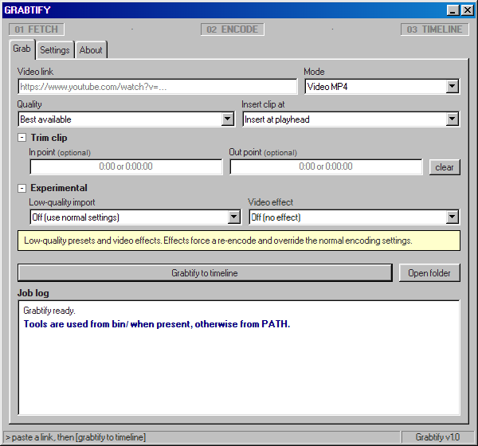

<a name="readme-top"></a>

<p align="center">
  
</p>

<p align="center">
  <em>Grab a web video and drop it straight onto your DaVinci Resolve timeline.</em>
</p>

<p align="center">
  
  
  
  
  <a href="https://ko-fi.com/pedrogott"></a>
</p>

Grabtify is a **DaVinci Resolve Workflow Integration plugin** for Windows. You
paste a link, it downloads the clip with **yt-dlp**, optionally trims it and
re-encodes it with **ffmpeg**, then imports the file into your project and
inserts it at the playhead — without leaving Resolve.

It runs inside Resolve's embedded Electron runtime, so there is no Python, no
separate window to babysit, and no configuration beyond a single `install.bat`.

> **Requires DaVinci Resolve Studio (paid).** Grabtify is a Workflow Integration
> plugin, and Workflow Integrations are a Studio-only feature — the free Resolve
> does not load them, so the panel never appears there.

## ⚡ Quick start

1. **Download the release zip** and extract it anywhere.
2. **Run `install.bat`** and accept the UAC prompt.
3. **In Resolve Studio**, open **Workspace → Workflow Integrations → Grabtify**.



## How it works

```
paste a link
     │
     ▼
[01 FETCH]    yt-dlp downloads the clip  ───────────────┐
     │                                                  │ optional
     ▼                                                  ▼
[02 ENCODE]   ffmpeg trims the in→out section and/or   ──►  MP3 (audio mode)
              re-encodes to H.264/AAC MP4                    or H.264 MP4
     │
     ▼
[03 TIMELINE] Resolve imports the file into the "Grabtify" bin and
              inserts it at the playhead / appends / bin-only
```

Downloads already prefer H.264/AAC MP4, so the encode pass runs only when you
opt in (re-encode, audio mode, or an encode-time trim) or the file uses an
unusual codec.

<details>
<summary><strong>📑 Table of contents</strong></summary>

- [🚀 Features](#-features)
- [✅ Requirements](#-requirements)
- [📦 Install](#-install)
- [🗑 Uninstall](#-uninstall)
- [🎬 Usage](#-usage)
- [⚙ Settings](#-settings)
- [🛠 Troubleshooting](#-troubleshooting)
- [🔒 Privacy & Legal](#-privacy--legal)
- [☕ Support](#-support)
- [📄 License](#-license)

</details>

## 🚀 Features

- **One-click grab** — paste a URL, hit *Grabtify to timeline*.
- **Quality cap** — best available, or up to 2160p / 1440p / 1080p / 720p.
- **Audio-only mode** — extract MP3 at 128 / 192 / 320 kbps.
- **Optional trim** — set in/out timecodes, cut either during download
  (fast) or during encoding (precise).
- **Optional re-encode** — normalize to H.264/AAC MP4 at Good / Balanced /
  Fast presets. Unusual codecs are converted automatically so Resolve never
  chokes on a downloaded file.
- **Three insert modes** — at the playhead, at the end of the sequence, or
  into the media pool only (files land in a `Grabtify` bin).
- **Live progress** — stage strip, progress bar, and a scrollable job console
  with real yt-dlp/ffmpeg output. Cancel mid-download.
- **Readiness check** — the Settings panel shows whether Resolve, yt-dlp, and
  ffmpeg are reachable before you start a job.
- **Bilingual** — English and Brazilian Portuguese.

## ✅ Requirements

- **Windows 10 or 11**
- **DaVinci Resolve Studio ≥ 19.0.2** — Workflow Integration plugins are a
  Studio feature and do not exist in the free Resolve
- **Internet on first install** — the installer downloads `yt-dlp.exe`,
  `ffmpeg.exe`, and `ffprobe.exe` into the plugin folder the first time you
  run it (skipped if they are already present or on your `PATH`)
- **Administrator rights once**, for the installer (it writes under
  `C:\ProgramData\Blackmagic Design`)

## 📦 Install

1. **Download the release zip** and extract it anywhere.
2. **Run `install.bat`.** Accept the UAC prompt. The installer runs a system
   check (Windows version, Resolve's Workflow Integration folder, internet,
   whether Resolve is open), lists a few warnings (Resolve Studio required,
   first-run tools download, administrator rights), then asks you to confirm.
   It copies the plugin into Resolve's Workflow Integration folder, locates
   BMD's `WorkflowIntegration.node` in your Resolve installation and copies it
   next to the plugin (see *Troubleshooting* if it cannot), and downloads
   `yt-dlp` / `ffmpeg` / `ffprobe` into `bin\win\` if missing.
3. **In Resolve Studio**, open **Workspace → Workflow Integrations →
   Grabtify**.

Re-run `install.bat` any time you update the plugin or move Resolve — it is
idempotent.

<details>
<summary><strong>Manual install (without install.bat)</strong></summary>

If you would rather place the files yourself:

1. **Close DaVinci Resolve.**
2. **Copy the plugin into Resolve's Workflow Integration folder.** The
   destination folder must be named exactly `com.grabtify.plugin`:
   `C:\ProgramData\Blackmagic Design\DaVinci Resolve\Support\Workflow
   Integration Plugins\com.grabtify.plugin`
   Copy only the runtime files — `manifest.xml`, `package.json`, `index.html`,
   `main.js`, `preload.js`, `newico.png`, and the `css`, `js`, and `bin`
   folders. Skip `install.bat`, `uninstall.bat`, `README.md`, `LICENSE`, and
   `.gitignore`. Writing under `ProgramData` needs administrator rights;
   accept the UAC prompt if Explorer asks.
3. **Make sure `WorkflowIntegration.node` sits next to `main.js`.** Resolve
   Studio usually provisions it on its own, but if the panel reports
   "Resolve not ready", get it from Resolve's **Help → Documentation →
   Developer** ("Workflow Integration Plugins" package) and copy
   `WorkflowIntegration.node` into the plugin folder.
4. **Install the command-line tools** into `bin\win\` (or anywhere on your
   `PATH`):
   - `yt-dlp.exe` — <https://github.com/yt-dlp/yt-dlp/releases/latest>
   - `ffmpeg.exe` and `ffprobe.exe` — an FFmpeg build such as
     <https://www.gyan.dev/ffmpeg/builds/> (extract both from the "essentials"
     archive)
5. **Restart DaVinci Resolve Studio**, then open **Workspace → Workflow
   Integrations → Grabtify**.

> The folder name must match `com.grabtify.plugin` exactly, or Resolve will not
> load the plugin.

</details>

## 🗑 Uninstall

Run `uninstall.bat` and confirm. It removes the plugin folder
(`com.grabtify.plugin`) from Resolve's Workflow Integration directory.
Downloaded clips and your settings are left untouched.

## 🎬 Usage

1. Open a project with an active timeline.
2. Paste a link into the URL field (YouTube, Instagram, Vimeo, Twitch, most
   sites yt-dlp supports). The panel fetches the video title while you type.
3. Pick a mode (**Video MP4** or **Audio MP3**), quality cap, and insert mode.
4. Optional: open *Trim clip* and set in/out timecodes.
5. Press **Grabtify to timeline**.

The job console streams progress; **Cancel** stops the download and kills the
tool process tree. When it finishes, the clip is in the media pool's
`Grabtify` bin and, depending on the insert mode, on the timeline.

## ⚙ Settings

Open the gear icon. Settings persist across sessions in
`%APPDATA%\Grabtify\settings.json`:

- **General** — interface language (English / Português (Brasil))
- **Video** — when trimming happens (during download vs during encode),
  encode quality, automatic encoding, always-encode-to-MP4
- **Storage** — where downloads are saved (default `Documents\Grabtify`)
- **System check** — live status of the Resolve binding, yt-dlp, and ffmpeg

## 🛠 Troubleshooting

**The panel never appears in Workspace → Workflow Integrations.** You are on
the free DaVinci Resolve. Workflow Integration plugins are a Studio-only
feature; Grabtify requires the paid **Resolve Studio** (≥ 19.0.2).

**The Resolve status stays red / "Resolve not ready".** The panel was opened
outside Resolve (double-clicking `main.js` will never work), or Resolve
Studio isn't running with a project open, or `WorkflowIntegration.node` is
missing next to `main.js`. Re-run `install.bat` after making sure Resolve is
installed; if the script could not find the `.node` file, grab it from
**Help → Documentation → Developer** ("Workflow Integration Plugins" package)
and copy it into `com.grabtify.plugin`.

**The yt-dlp / ffmpeg chips are red.** The installer downloads them into
`bin\win\`. Antivirus sometimes quarantines freshly downloaded command-line
tools — add an exclusion for the plugin folder, re-run `install.bat`, or
install yt-dlp and ffmpeg yourself and let the plugin pick them up from your
`PATH`.

**The panel opens but a job fails right after "Encoded: …".** That is the
Resolve handoff (`importAndInsert`). Copy the job console log — it states
whether the import or the timeline insert failed.

**Duplicate plugin in the menu.** An older copy may linger. Delete
`C:\ProgramData\Blackmagic Design\DaVinci Resolve\Support\Workflow
Integration Plugins\com.grabtify.plugin` and re-run `install.bat`.

## 🔒 Privacy & Legal

- Everything runs locally. No account, no telemetry, no analytics, no
  third-party servers — the only outbound requests are yt-dlp hitting the
  site you asked it to download from.
- Fetch only videos you own or are licensed to download. Most platforms'
  terms restrict downloading, and this tool does not bypass DRM.
- The bundled CLI tools are third-party open-source software:
  **yt-dlp** (Unlicense, <https://github.com/yt-dlp/yt-dlp>) and
  **FFmpeg** (LGPL/GPL, <https://ffmpeg.org>). Their binaries are downloaded
  from their official distributions at install time.

## ☕ Support

Found a bug or want a feature? Open an issue. If this saves you time,
[buy me a coffee](https://ko-fi.com/pedrogott) — it keeps the project going.

## 📄 License

[MIT](LICENSE).

---

<p align="center">
  <a href="#readme-top">Back to top ⤴</a>
</p>
